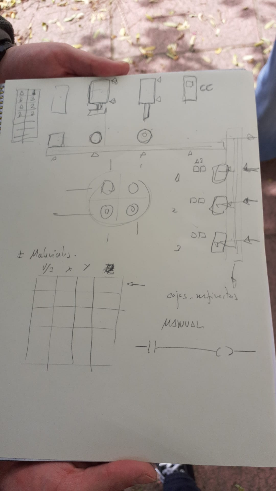

* Primera entrega

La primera entrega consiste en un boceto de la pantalla de visualización en el que se
muestren todas las señales del sistema, incluyendo sensores y actuadores, y una
descripción de los objetivos de control (funcionamiento esperado del sistema).

+ Boceto en PDF (dibujado a mano o diseñado con cualquier programa)
+ Lista de sensores y actuadores en PDF

* Segunda entrega
La segunda entrega consiste en una simulación de la planta, con el
modo manual implementado.

file:entrega2.png
